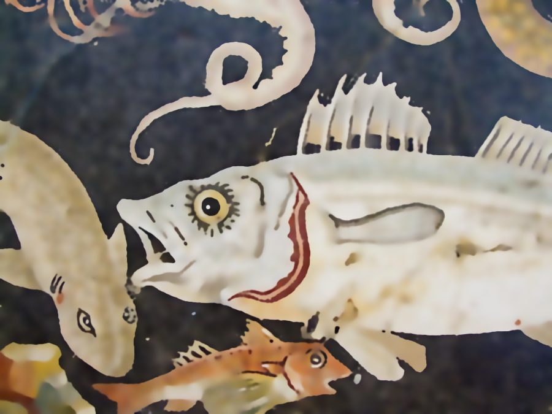

# Scale-adaptive Structure-preserving Texture Filtering
MATLAB implementation of <b>"Scale-adaptive Structure-preserving Texture Filtering"</b>

A sample :  
Source : the fish mosaic image
   
Result: filtered image

 

## Contributors
[Chengfang Song](http://cfsong.github.com/) (chfsong@gmail.com) 
Chengfang Song

